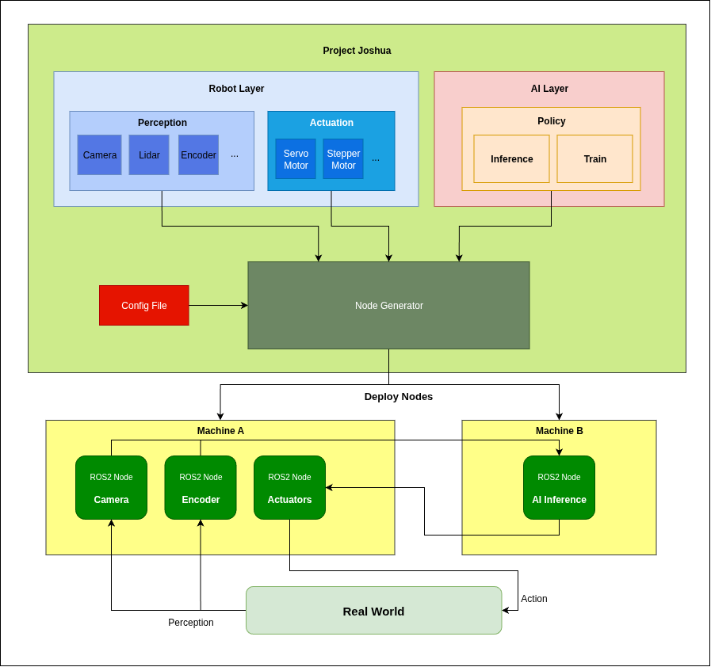

# Project Joshua: Modular Framework for Robotic AI Systems

Project Joshua is an user-friendly, and modular framework designed to streamline the development and deployment of **ANY** robots to AI system using ROS2. **A single configuration file** automatically instantiates all actuator and perception interfaces, AI model policies, and parameters. This allows users to effortlessly run **ANY** robots with your selected hardware, specs and AI policy.

This system utilized the ROS2 and protobuf. A configuration file should contain all the necessary information for the robot inlcuding actions (e.g. number of actuators, actuator type), perceptions (e.g. camera, encoders) and AI policy. For example, a single configuration file like [so100_with_example_ai.pbtxt](`config/config_preset/so100_with_example_ai.pbtxt`) defines your entire robot and AI system. Based on this single file, ROS2 nodes will be instantiated and make the robot operational.

## Core Concepts

The architecture is centered around the **Node Generator**. Single configuration file fed into the Node Generator and this will instantiate and run all the hardware interface and AI inference API as a ROS2 node. 

### TODO
- Implement auto calibration for actuator and store it as a config file.
- Implement UI for generating the config file.
- Implement automatic node executors based on config file.

## Key Features & Benefits:

### Simplified Configuration

At the core of Project Joshua's ease of use is its single configuration file approach. A simple text file (e.g., [so100_with_example_ai.pbtxt](`config/config_preset/so100_with_example_ai.pbtxt`)) is all that's needed to define and orchestrate an entire robotic AI system. This eliminates the need for extensive manual setup and reduces potential for configuration errors.

### Automated System Setup

From a single configuration, Project Joshua automatically handles the creation and setup of:

- **Hardware Interfaces**: Seamlessly integrates with various robotic hardware components, abstracting away low-level complexities.

- **AI Model Policies**: Defines and loads the specific AI models and their operational policies.

- **Parameters**: Manages all necessary system parameters, ensuring consistent behavior across deployments.

- **Tasks**: Configures and initiates the specific robotic tasks the system is designed to perform. (e.g. Inference, Train)

### Modular Architecture

The framework's modular design ensures flexibility and extensibility. New hardware components, AI models, or tasks can be easily integrated without significant refactoring of the core system. This promotes rapid prototyping and iterative development.

### Reduced Learning Curve

By abstracting away the intricacies of hardware-software integration, Project Joshua significantly lowers the barrier to entry for both AI/ML engineers and robotics hardware specialists. This fosters greater collaboration and accelerates the development cycle.

### Accelerated Deployment

The streamlined configuration and automated setup capabilities drastically reduce the time from development to real-world deployment, allowing teams to iterate faster and bring robotic AI solutions to market more efficiently.

### Scalability

Designed with scalability in mind, Project Joshua can accommodate a wide range of robotic systems, from simple prototypes to complex, multi-component deployments.