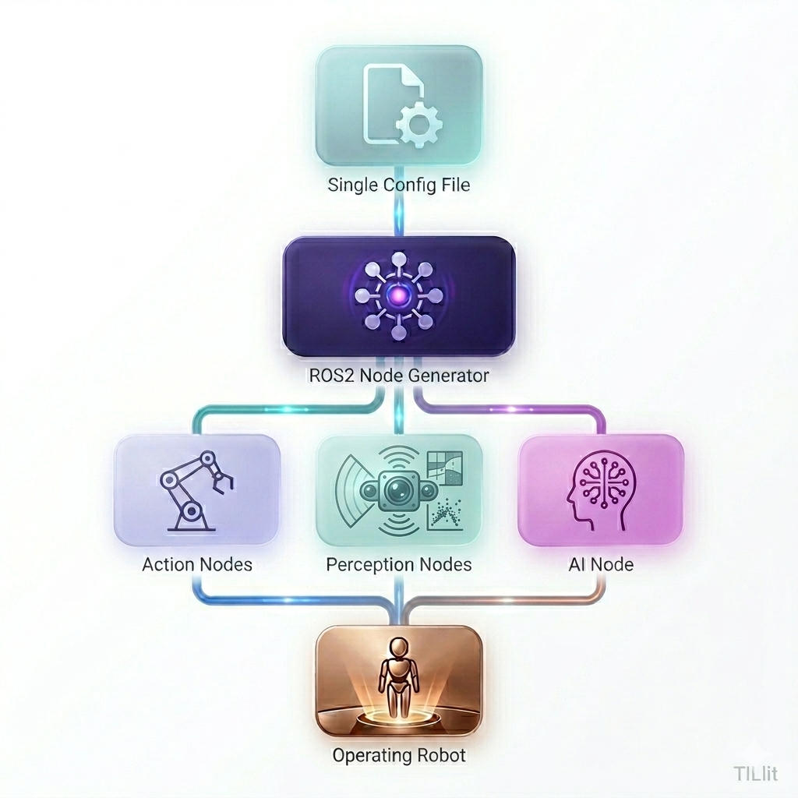

# JOSHUA (**J**oint **O**pen-**S**ource **H**ub for **U**niversal **A**utomation)

**A modular framework for robotic AI systems**

**Version:** see [`VERSION`](VERSION)

Joshua turns a single protobuf config into a running robot stack on ROS 2: hardware (actions and perceptions), AI policy, and operation mode. The launcher builds and runs the right nodes; the React control panel lets you configure, launch, and monitor the system.



One config file is the source of truth—for example [`config/config_preset/so100/teleoperate.pbtxt`](config/config_preset/so100/teleoperate.pbtxt) defines the full SO100 teleop setup. See [Architecture](docs/ARCHITECTURE.md) for how config, protobuf packets, and ROS 2 fit together.

## Quick start

**Docker (recommended for first try):**

```bash
docker compose build joshua-u22
docker compose run joshua-u22
bazel run launcher:joshua_main
```

**Native Ubuntu 22.04:**

```bash
sudo ./scripts/setup.sh --env=dev
bazel run launcher:joshua_main
```

Install options (ARM64, ROS Jazzy), SO100 teleop, simulation presets, and the web UI: [docs/GETTING_STARTED.md](docs/GETTING_STARTED.md). Joshua targets **Ubuntu Linux**; macOS is not supported.

## Build deployable binaries

For development, use `bazel run` as above. To produce a packaged, deployable build (launcher binary, presets, and runtime files), use [`scripts/build.py`](scripts/build.py). It runs Bazel inside the matching Docker image and copies artifacts to `dist/<os>/<cpu>/`.

```bash
# Ubuntu 22.04 (Humble), x86_64 — default
./scripts/build.py //launcher:joshua_main_pkg

# Ubuntu 24.04 (Jazzy), ARM64 (e.g. Jetson; uses emulation on x86 hosts)
./scripts/build.py //launcher:joshua_main_pkg --os=u24 --cpu=arm64
```

| Flag | Values | Default |
|------|--------|---------|
| `--os` | `u22` (22.04 / Humble), `u24` (24.04 / Jazzy) | `u22` |
| `--cpu` | `x86`, `arm64` | `x86` |

Output: `dist/u22/x86/joshua_main_pkg-<version>-u22-x86.tar.gz` (version from [`VERSION`](VERSION); paths vary by flags). The archive includes a `VERSION` file and `joshua_main --version` reports the same value. Extract and run on a target machine with the matching Ubuntu/ROS stack. Full details: [scripts/README.md](scripts/README.md).

## Documentation

| Topic | Guide |
|-------|--------|
| Getting started | [docs/GETTING_STARTED.md](docs/GETTING_STARTED.md) |
| Architecture | [docs/ARCHITECTURE.md](docs/ARCHITECTURE.md) |
| All docs index | [docs/README.md](docs/README.md) |
| Scripts and builds | [scripts/README.md](scripts/README.md) |
| Simulation (MuJoCo, Isaac Sim) | [simulation/README.md](simulation/README.md) |
| Web UI | [ui/README.md](ui/README.md) |
| Contributing | [CONTRIBUTING.md](CONTRIBUTING.md) |
| AI coding agents | [AGENTS.md](AGENTS.md) |
| Security | [SECURITY.md](SECURITY.md) |

## License

Joshua is licensed under the [Apache License, Version 2.0](LICENSE). See
[NOTICE](NOTICE) for attribution and [THIRD_PARTY_NOTICES.md](THIRD_PARTY_NOTICES.md)
for dependencies.
