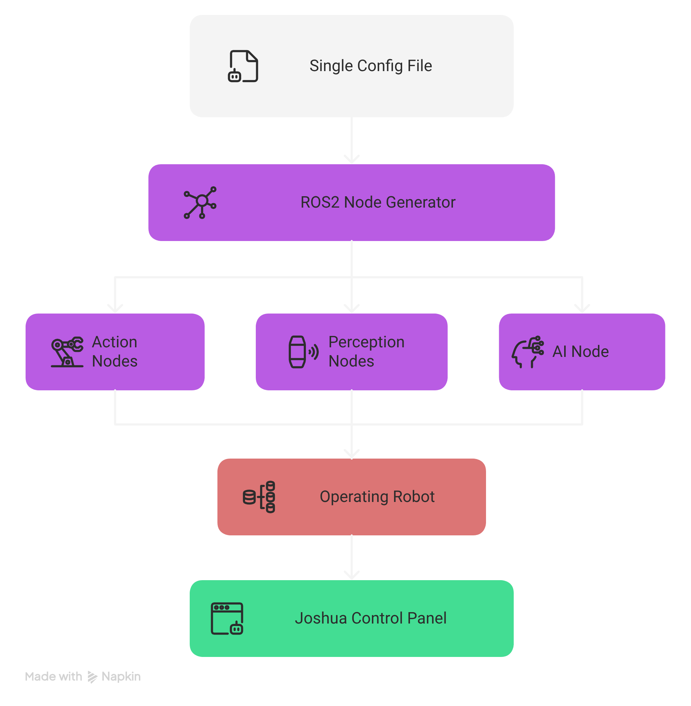

# JOSHUA (**J**oint **O**pen-**S**ource **H**ub for **U**niversal **A**utomation)
## *A Modular Framework for Robotic AI Systems*

Project Joshua is a user‑friendly, modular framework that turns a single configuration file into a running robot system using ROS2 and Protocol Buffers. A single text config defines your robot hardware (actions and perceptions), AI policy, and operation mode. The system then builds and runs the corresponding ROS2 nodes and lets you monitor/control them from a Qt6 GUI.

## Core Concepts


Project Joshua uses ROS2 and Protocol Buffers. A single configuration file is the source of truth for your robot: it declares actions (e.g., number of actuators, actuator type), perceptions (e.g., cameras, encoders), AI policy, and operation mode. For example, a file like [`config/config_preset/so100_mock_inference.pbtxt`](config/config_preset/so100_mock_inference.pbtxt) defines the entire robot and AI system. From this one file, the system instantiates the required ROS2 nodes and runs them to make the robot operational.

The Joshua Control Panel (Qt6 C++ GUI) ties it together: you can create or load the configuration, build required targets, launch the selected preset, and monitor running nodes and their publish/subscribe topics—all from one place.


## Quick Start Example

### Prerequisites

- **Operating System:** Ubuntu 22.04 LTS
- **ROS2:**  
  ```bash
  sudo apt-get install ros2
  ```
  **Add ROS2 Rules Dendency:**  
  ```bash
  git clone https://github.com/mvukov/rules_ros2.git external/rules_ros2
  ```
  **Installed Qt6 Development Packages**  
  ```bash
  sudo apt install -y qt6-base-dev qt6-base-dev-tools qt6-tools-dev qt6-tools-dev-tools
  ```
- **OpenCV:**  
  ```bash
  sudo apt-get install libopencv-dev
  ```
- **Bazel Build System:**  
  [Install Bazel](https://bazel.build/install) following the official instructions.

- **User Permissions:**  
  Add your user to the appropriate groups if required (e.g., for hardware access):
  ```bash
  sudo usermod -aG dialout $USER # Then reboot
  ```

- **Camera Access:**  
  For USB cameras (especially HHWei cameras), ensure proper video device access:
  ```bash
  sudo usermod -aG video $USER
  newgrp video
  ```

### Example: Running SO100 Teleoperation with Follower and Lead Arm

This example demonstrates how to launch the SO100 robot in teleoperation mode, with both the follower and lead arm managed according to your configuration file. The configuration file is predefined at [`config/config_preset/so100_teleoperate.pbtxt`](config/config_preset/so100_teleoperate.pbtxt).

*Please make sure to calibrate the operational limits for your servo motors.*

**To start the system with GUI:**

```bash
bazel run joshua_control_panel:joshua_control_panel
```

**To start the system with terminal:**

```bash
bazel build node_generator:joshua_main
```

TODO: Add calibration instruction here.

## Troubleshooting

### USB Camera Not Detected

If your USB camera (especially HHWei cameras) is not showing up as `/dev/video*` devices:

1. **Check if camera is detected by USB:**
   ```bash
   lsusb | grep -i camera
   ```

2. **Ensure you're in the video group:**
   ```bash
   sudo usermod -aG video $USER
   newgrp video
   ```

3. **Check if UVC drivers are loaded:**
   ```bash
   lsmod | grep uvc
   ```

4. **If no video devices appear, try unplugging and reconnecting the camera** - this often resolves initialization issues.

5. **Verify camera is working:**
   ```bash
   ls -l /dev/video*
   v4l2-ctl --list-devices
   ```

**Solution Summary:** The most common fix is adding your user to the `video` group and unplugging/reconnecting the camera to trigger proper device node creation.

## Key Features & Benefits:

### Simplified Configuration

At the core of Project Joshua's ease of use is its single configuration file approach. A simple text file (e.g., [so100_with_example_ai.pbtxt](`config/config_preset/so100_with_example_ai.pbtxt`)) is all that's needed to define and orchestrate an entire robotic AI system. This eliminates the need for extensive manual setup and reduces potential for configuration errors.

### Automated System Setup

From a single configuration, Project Joshua automatically handles the creation and setup of:

- **Hardware Interfaces**: Seamlessly integrates with various robotic hardware components, abstracting away low-level complexities.

- **AI Model Policies**: Defines and loads the specific AI models and their operational policies.

- **Parameters**: Manages all necessary system parameters, ensuring consistent behavior across deployments.

- **Tasks**: Configures and initiates the specific robotic tasks the system is designed to perform. (e.g. Inference, Train)

### Modular Architecture

The framework's modular design ensures flexibility and extensibility. New hardware components, AI models, or tasks can be easily integrated without significant refactoring of the core system. This promotes rapid prototyping and iterative development.

### Reduced Learning Curve

By abstracting away the intricacies of hardware-software integration, Project Joshua significantly lowers the barrier to entry for both AI/ML engineers and robotics hardware specialists. This fosters greater collaboration and accelerates the development cycle.

### Accelerated Deployment

The streamlined configuration and automated setup capabilities drastically reduce the time from development to real-world deployment, allowing teams to iterate faster and bring robotic AI solutions to market more efficiently.

### Scalability

Designed with scalability in mind, Project Joshua can accommodate a wide range of robotic systems, from simple prototypes to complex, multi-component deployments.

## Used Open Source

Project Joshua is built on top of several excellent open-source technologies:

- **[ROS2](https://docs.ros.org/en/humble/)** - Robot Operating System 2 for distributed robotics software
- **[Protobuf](https://developers.google.com/protocol-buffers)** - Google's language-neutral, platform-neutral, extensible mechanism for serializing structured data
- **[Bazel](https://bazel.build/)** - Fast, scalable, multi-language build system
- **[PyQt](https://www.riverbankcomputing.com/software/pyqt/)** - Python bindings for the Qt application framework

## Data Type Architecture

Project Joshua employs a **dual-layer data type system** that ensures type safety, scalability, and modularity throughout the entire robotic system:

### Configuration Layer (Protobuf)
The system uses **Protocol Buffers (protobuf)** for all configuration and internal data structures:

- **`config.proto`**: Defines the main configuration structure with `General`, `Robot`, and `Ai` components
- **`robot.proto`**: Specifies robot hardware configuration including actions and perceptions
- **`ai.proto`**: Defines AI policy configurations and model parameters
- **`action.proto`**: Configures actuator types, communication interfaces, and operational parameters
- **`perception.proto`**: Defines sensor configurations for cameras, encoders, and other perception devices

### Runtime Data Layer (Protobuf + ROS2)
During runtime, the system uses a **hybrid approach** for optimal performance and compatibility:

#### Internal Communication (Protobuf)
- **`action_packet.proto`**: Structured action commands with support for:
  - Simple commands (position, torque, speed)
  - Preset commands (middle position, idle, graceful shutdown)
  - Complex multi-parameter actions
- **`perception_packet.proto`**: Unified perception data format supporting:
  - Image data (width, height, channels, encoding, raw bytes)
  - Position data (position, velocity)
  - Sensor data (multi-value arrays with labels)
  - Point cloud data (for future LiDAR/Radar sensors)

#### ROS2 Node Communication (Standard ROS2 Messages)
Between ROS2 nodes, the system uses **standard ROS2 message types** for maximum compatibility:

- **`std_msgs/msg/Float32`**: For encoder position data and actuator commands
- **`sensor_msgs/msg/Image`**: For camera image data with proper encoding conversion
- **Future**: Support for custom ROS2 messages compatible with protobuf definitions

### Data Flow Architecture

```
Hardware Interface → Protobuf Packets → ROS2 Publishers → ROS2 Messages → ROS2 Subscribers → Protobuf Packets → Hardware Interface
```

This architecture provides:
- **Type Safety**: Protobuf ensures data integrity at the hardware interface level
- **Performance**: Efficient serialization/deserialization for internal communication
- **Compatibility**: Standard ROS2 messages enable integration with existing ROS2 ecosystem
- **Extensibility**: Easy addition of new sensor types and action commands
- **Modularity**: Clear separation between configuration, runtime data, and ROS2 communication
