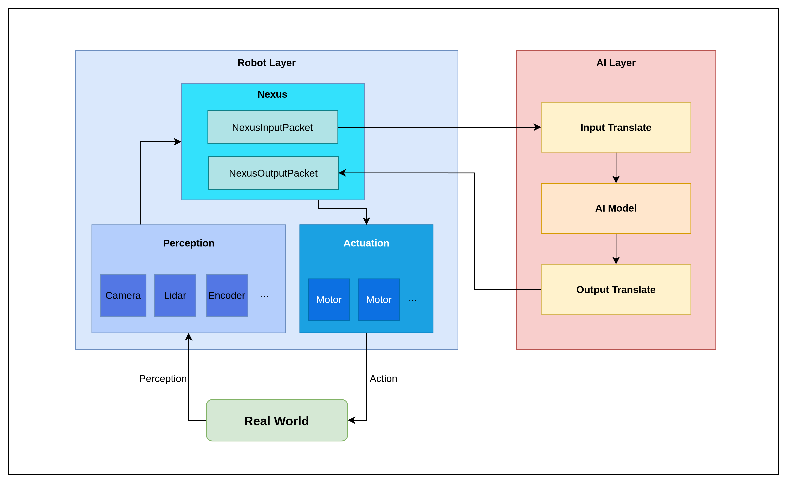

# Project Joshua: Modular Framework for Robotic AI Systems

Project Joshua is an user-friendly, and modular framework designed to streamline the development and deployment of robotic AI systems. **A single configuration file** automatically generates all actuator and perception interfaces, AI model policies, and parameters. This allows users to effortlessly run robots with your selected hardware and AI policy.

For example, a single configuration file like [so100_with_dt.pbtxt](`config/config_preset/so100_with_dt.pbtxt`) defines your entire robot and AI system.

## Vision

Project Joshua was initiated to bridge a critical gap: the inherent challenge AI/ML and hardware engineers face when seamlessly integrating robotics and AI into a single, cohesive platform. By addressing this, our aim is to democratize access to advanced robotic AI development.

While the project began as a startup endeavor, the vision for its widespread public benefit through open-sourcing quickly became clear. I firmly believe that by providing a user-friendly, accessible, modular, and community-driven platform, Project Joshua can accelerate innovation and benefit the robotics and AI landscape.

## Key Features & Benefits:

### Simplified Configuration

At the core of Project Joshua's ease of use is its single configuration file approach. A simple text file (e.g., [so100_with_dt.pbtxt](`config/config_preset/so100_with_dt.pbtxt`)) is all that's needed to define and orchestrate an entire robotic AI system. This eliminates the need for extensive manual setup and reduces potential for configuration errors.

### Automated System Setup

From a single configuration, Project Joshua automatically handles the creation and setup of:

- **Hardware Interfaces**: Seamlessly integrates with various robotic hardware components, abstracting away low-level complexities.

- **AI Model Policies**: Defines and loads the specific AI models and their operational policies.

- **Parameters**: Manages all necessary system parameters, ensuring consistent behavior across deployments.

- **Tasks**: Configures and initiates the specific robotic tasks the system is designed to perform. (e.g. Inference, Train)

### Modular Architecture

The framework's modular design ensures flexibility and extensibility. New hardware components, AI models, or tasks can be easily integrated without significant refactoring of the core system. This promotes rapid prototyping and iterative development.

### Reduced Learning Curve

By abstracting away the intricacies of hardware-software integration, Project Joshua significantly lowers the barrier to entry for both AI/ML engineers and robotics hardware specialists. This fosters greater collaboration and accelerates the development cycle.

### Accelerated Deployment

The streamlined configuration and automated setup capabilities drastically reduce the time from development to real-world deployment, allowing teams to iterate faster and bring robotic AI solutions to market more efficiently.

### Scalability

Designed with scalability in mind, Project Joshua can accommodate a wide range of robotic systems, from simple prototypes to complex, multi-component deployments.

## Core Concepts



The architecture is centered around the **Nexus**, which acts as the robot's central nervous system. It operates on a simple loop:

1.  **Perception**: Gathers data from all registered sensors (like cameras).
2.  **Decision Making**: Packages the sensor data and sends it to an AI layer for processing.
3.  **Action**: Receives action commands from the AI layer and dispatches them to the appropriate motors or actuators.

4.  **Train(TODO)**: Send the packaged sensor and action data to train the policy.

This decoupled design allows for modular development, where new sensors, actuators, and AI models can be integrated with minimal changes to the core system. For a more detailed explanation on **Nexus**, see the [README.md](robot/nexus/README.md).

## Technology Stack

- **C++**: The primary language for performance-critical robotics applications.
- **Bazel**: The build system used for managing dependencies and ensuring reproducible builds.
- **Protobuf**: Used for serializing structured data for communication between different parts of the system.
- **glog / gflags**: For robust logging and command-line argument parsing.
- **pybind**: Integrate both C++ Robot layer and Python AI layer.
- **OpenCV**: For camera and computer vision-related tasks.
- **HuggingFace**: To import policies, configs, and tools.

## Getting Started (WIP)

### Prerequisites

- A C++ compiler (supporting C++14 or later)
- [Bazel](https://bazel.build/install) build system

### Building the Project

To build all targets, run the following command from the project's root directory:

```bash
bazel build //...
```

### Running the Main Application

To run the primary Nexus application, which starts the robot's main control loop, use the following command:

```bash
bazel run //:main_program
```

### Working with Python Dependencies

This project uses a robust, Bazel-compatible setup for managing Python dependencies to ensure builds are hermetic and reproducible. The system relies on `pip-tools` and a locked set of requirements.

#### Structure Overview

- **`requirements.txt`**: This is a simple, human-readable file where you declare the project's **direct** Python dependencies (e.g., `numpy`, `torch`). You only list the packages you directly `import`.

- **`requirements.lock`**: This is the single source of truth for Bazel. It is an auto-generated file containing the exact versions of _all_ packages (including transitive dependencies). This file is created by `pip-compile` and ensures that every build is identical. **You must commit this file to the repository whenever it changes.**

- **`venv/`**: This project includes a local virtual environment. Its only role in the build process is to provide a consistent environment for running `pip-compile`. It is **not** used by Bazel for building or running code, which uses its own hermetic toolchain. You can, however, activate it for local development and IDE support (e.g., for autocomplete).

#### How to Add or Update a Python Dependency

Follow this two-step process to modify the Python dependencies:

1.  **Edit `requirements.txt`**: Add, remove, or change the version specifier for any top-level package in the `requirements.txt` file.

2.  **Regenerate the Lock File**: Run the following commands from the project root to update `requirements.lock` with your changes and all the necessary transitive dependencies.

    ```bash
    # Activate the local virtual environment
    source venv/bin/activate

    # Re-compile the requirements to update the lock file
    pip-compile --allow-unsafe requirements.txt -o requirements.lock

    # You can now deactivate the venv if you wish
    deactivate
    ```

3.  **Commit Your Changes**: Add both the modified `requirements.txt` and the newly generated `requirements.lock` to your git commit.
