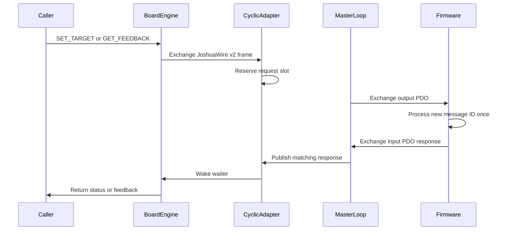
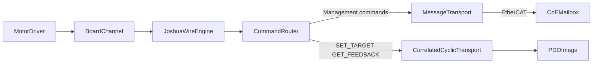

# Board and Comm Separation Plan

Status: **Proposed**

Companion to: [BOARD_LAYER_RFC.md](BOARD_LAYER_RFC.md),
[am243_ethercat.md](am243_ethercat.md)

## 1. Goal

Separate board protocol behavior from communication resource ownership while
making JoshuaWire available over EtherCAT.

Motor drivers continue to depend only on
[`BoardChannel`](../robot/board/interfaces/board_channel.h). Board code owns
identity, channel configuration, command routing, and protocol semantics. Comm
code owns serial ports, EtherCAT masters, CoE mailbox access, PDO exchange,
timeouts, synchronization, and shared-resource lifetime.

JoshuaWire over EtherCAT uses both native EtherCAT planes:

- `IDENTIFY`, `CONFIGURE_CHANNEL`, `ENABLE`, `DISABLE`, and `ESTOP` use
  CoE/SDO mailbox request-response.
- `SET_TARGET` and `GET_FEEDBACK` use correlated request and response slots in
  the cyclic PDO image.

The current TI eight-byte echo demo remains a bring-up artifact. This design
requires Joshua-controlled AM243 firmware and a matching PDO/ESI definition.

## 2. Stable public interface

The refactor does not change
[`BoardInterface`](../robot/board/interfaces/board_interface.h) or
[`BoardChannel`](../robot/board/interfaces/board_channel.h):

```cpp
class BoardChannel {
 public:
  virtual absl::Status Enable() = 0;
  virtual absl::Status Disable() = 0;
  virtual absl::Status SetTarget(TargetMode mode, float value) = 0;
  virtual absl::StatusOr<ChannelFeedback> ReadFeedback() = 0;
};
```

The selected comm determines how those operations travel, but motor drivers do
not see serial, EtherCAT, SOEM, CoE, SDO, or PDO types.

## 3. JoshuaWire v2 correlation

JoshuaWire v2 adds a nonzero, little-endian `uint16_t message_id` to every
request. Every response echoes the request's ID.

The v2 frame is:

```text
[sync][len][proto_ver][message_id_le][cmd][channel][payload...][crc16_le]
```

The length and CRC cover `message_id` along with the remaining header and
payload. The decoded frame becomes conceptually:

```c
typedef struct {
  uint8_t proto_ver;
  uint16_t message_id;
  uint8_t cmd;
  uint8_t channel;
  const uint8_t* payload;
  uint8_t payload_len;
} jw2_frame_t;
```

Protocol rules:

- Message ID `0` is reserved and never allocated.
- The host allocates IDs monotonically and wraps after `UINT16_MAX`.
- A response must match message ID, command, and channel.
- Stale, duplicate, or mismatched responses do not complete a call.
- A timed-out ID remains quarantined from late responses until transport state
  has advanced past that response.
- JoshuaWire v1 remains available during migration. Current firmware and
  presets move to v2 only after both endpoints support it; v1 wire bytes are
  not silently reinterpreted as v2.

## 4. Communication seams

There are two comm interfaces rather than one interface containing
transport-specific methods.

### 4.1 Message transport

`MessageTransport` handles acyclic payload exchange. Serial and EtherCAT CoE
are adapters behind this seam. It supports both request-response exchange and
explicit send-only behavior needed by vendor protocols such as Feetech.

Conceptually:

```cpp
class MessageTransport {
 public:
  virtual absl::Status Send(absl::Span<const uint8_t> request) = 0;
  virtual absl::StatusOr<std::vector<uint8_t>> Exchange(
      absl::Span<const uint8_t> request) = 0;
};
```

JoshuaWire management commands use `Exchange`. EtherCAT implements it through
CoE/SDO mailbox objects; serial implements it through framed byte-stream I/O.

### 4.2 Correlated cyclic transport

The EtherCAT cyclic adapter exposes correlated command exchange without
leaking PDO regions or SOEM types to the board engine:

```cpp
class CorrelatedCyclicTransport {
 public:
  virtual absl::StatusOr<std::vector<uint8_t>> Exchange(
      absl::Span<const uint8_t> request,
      absl::Duration timeout) = 0;
};
```

Only `SET_TARGET` and `GET_FEEDBACK` are accepted by this adapter. The board
engine rejects any routing table that sends another command through it.

## 5. EtherCAT runtime model

Each EtherCAT master has one background cyclic loop. It is the only code that
calls SOEM process-data send/receive. A blocked board call never drives the bus
itself.



The initial implementation allows one in-flight cyclic request per
board/slave adapter. One master loop may service several slave PDO regions.
Concurrent callers targeting the same adapter serialize on its request slot.

The fixed PDO layout contains:

- Output request-valid or generation state.
- Output request frame length and bounded JoshuaWire v2 frame bytes.
- Input response-valid or generation state.
- Input response frame length and bounded JoshuaWire v2 frame bytes.

Publishing follows a release/acquire-style ownership protocol so firmware
never reads a partially written request and the host never reads a partially
written response.

Completion requires a newly observed response whose message ID, command, and
channel match the active request. Timeout, bus failure, or teardown clears the
active waiter and returns an error. Late responses are discarded.

The cyclic period and response timeout are configuration values. Working-count
failure, loss of OPERATIONAL state, or a stopped loop fails pending calls.

## 6. EtherCAT mailbox model

The SOEM adapter gains CoE/SDO read and write operations. Joshua-controlled
AM243 firmware exposes object-dictionary entries for request and response
JoshuaWire v2 frames.

Mailbox exchange is used only for management operations:

```text
IDENTIFY
CONFIGURE_CHANNEL
ENABLE
DISABLE
ESTOP
```

Mailbox timeouts and serialization belong to the comm adapter. The board
engine sees only a `MessageTransport`.

`ESTOP` is also reflected as latched firmware safety state. Loss or staleness
of cyclic traffic must place outputs into the documented safe/disabled state;
mailbox delivery alone is not the motor-safety mechanism.

## 7. Board engine and factory assembly

A composed JoshuaWire board engine routes by command:



[`CommFactory`](../robot/comm/factory/comm_factory.cc) creates ready-to-use
serial or EtherCAT adapters and owns configure/start/stop, master caching,
serialization, and shared-resource leases.

[`BoardFactory`](../robot/board/factory/board_factory.cc) resolves these axes
independently:

- Board type to board identity.
- Protocol to JoshuaWire or a vendor protocol adapter.
- Comm type to available message and cyclic capabilities.

An EtherCAT JoshuaWire configuration is rejected unless both its CoE message
adapter and correlated PDO adapter are available. Feetech remains a separate
message-protocol adapter.

## 8. Configuration changes

Add explicit board protocol selection so the factory does not reconstruct a
hidden `board_type × comm_type` matrix.

Move EtherCAT endpoint facts—slave index and optional PDO region overrides—from
AM243 board configuration into
[`EthercatConfig`](../robot/comm/proto/comm.proto). Keep the selected PDO
mapping as board protocol/layout data.

Add:

- EtherCAT cyclic period.
- EtherCAT cyclic response timeout.
- Serial post-open settle delay, replacing the ESP32 board-specific sleep.

## 9. Firmware work

Introduce a Joshua-controlled AM243 EtherCAT firmware/profile rather than
modifying the retained TI demo.

The firmware must:

- Implement the JoshuaWire v2 codec and echo request IDs in every response.
- Expose CoE object-dictionary entries for management requests and responses.
- Consume each new PDO request once.
- Accept only `SET_TARGET` and `GET_FEEDBACK` through the PDO command slot.
- Publish a correlated PDO response.
- Define stale-target and communication-loss watchdog behavior.
- Latch disabled/safe state after ESTOP or cyclic communication loss.
- Share packed PDO definitions with the host or verify them with size and
  offset assertions and golden-layout tests.

Document or generate the matching ESI and PDO mapping.

## 10. Migration sequence

1. Update this design and the board-layer RFC with the v2 and dual-plane
   contracts.
2. Add JoshuaWire v2 beside v1, including correlation tests and response-ID
   propagation through existing serial firmware.
3. Add message and correlated-cyclic comm interfaces, fakes, and BUILD
   visibility rules.
4. Add SOEM CoE/SDO support and the single-owner background cyclic loop.
5. Implement the host PDO codec and Joshua-controlled AM243 firmware/profile.
6. Compose the JoshuaWire board engine and migrate AM243 after serial v2 is
   stable.
7. Remove `Am243Board::serial_mode_` and board-layer dependencies on concrete
   serial/SOEM implementations.

## 11. Verification

Required host and shared-codec tests:

- JoshuaWire v2 exact golden bytes and CRC coverage.
- v1/v2 compatibility and explicit version rejection.
- Every response echoes its request ID.
- Message ID wrap skips zero.
- One-in-flight serialization.
- Stale, duplicate, wrong-command, and wrong-channel response rejection.
- Timeout and late response after timeout.
- Bus failure and teardown cancellation.
- Management commands route only to mailbox.
- `SET_TARGET` and `GET_FEEDBACK` route only to PDO.
- Host and firmware PDO size/offset agreement.
- Only the background master loop performs process-data exchange.
- Shared EtherCAT master lifetime across multiple board/slave adapters.

Run focused Bazel tests during migration, format BUILD files with buildifier,
then run both Compose CI task services:

```bash
docker compose run --rm test-u22
docker compose run --rm test-u24
```

Tests and builds do not require attached hardware. Do not run a hardware preset
or flash firmware without explicit hardware confirmation.

## 12. Acceptance criteria

- Motor drivers remain unchanged and depend only on `BoardChannel`.
- JoshuaWire v2 works over serial with correlated responses.
- EtherCAT management commands use CoE/SDO.
- EtherCAT `SET_TARGET` and `GET_FEEDBACK` use correlated PDO slots.
- One background loop exclusively owns each EtherCAT master's process-data
  exchange.
- Timeout, teardown, stale responses, and message-ID wrap are deterministic
  and tested.
- Board targets cannot name concrete serial or SOEM implementations.
- The retained TI demo remains independently runnable for bring-up and is not
  mistaken for the JoshuaWire EtherCAT firmware.
