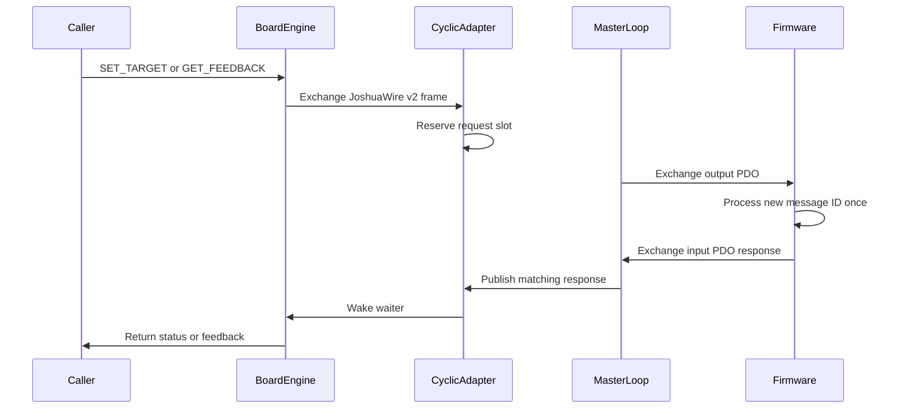
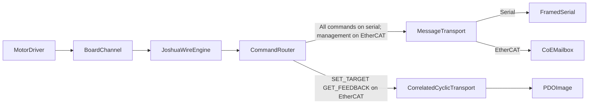

# Board and Comm Separation Plan

Status: **Proposed**

Companion to: [BOARD_LAYER_RFC.md](BOARD_LAYER_RFC.md),
[am243_ethercat.md](am243_ethercat.md)

## 1. Goal

Separate board protocol behavior from communication resource ownership while
making JoshuaWire available over EtherCAT.

Motor drivers continue to depend only on
[`BoardChannel`](../robot/board/interfaces/board_channel.h). Board code owns
identity, channel configuration, command routing, and protocol semantics. Comm
code owns serial ports, EtherCAT masters, CoE mailbox access, PDO exchange,
timeouts, synchronization, and shared-resource lifetime.

JoshuaWire over EtherCAT uses both native EtherCAT planes:

- `IDENTIFY`, `CONFIGURE_CHANNEL`, `ENABLE`, `DISABLE`, and `ESTOP` use
  CoE/SDO mailbox request-response.
- `SET_TARGET` and `GET_FEEDBACK` use correlated request and response slots in
  the cyclic PDO image.

The current TI eight-byte echo demo remains a bring-up artifact. This design
requires Joshua-controlled AM243 firmware and a matching PDO/ESI definition.

## 2. Stable public interface

The refactor does not change
[`BoardInterface`](../robot/board/interfaces/board_interface.h) or
[`BoardChannel`](../robot/board/interfaces/board_channel.h):

```cpp
class BoardChannel {
 public:
  virtual absl::Status Enable() = 0;
  virtual absl::Status Disable() = 0;
  virtual absl::Status SetTarget(TargetMode mode, float value) = 0;
  virtual absl::StatusOr<ChannelFeedback> ReadFeedback() = 0;
};
```

The selected comm determines how those operations travel, but motor drivers do
not see serial, EtherCAT, SOEM, CoE, SDO, or PDO types.

## 3. JoshuaWire v2 correlation

JoshuaWire v2 adds nonzero, little-endian `uint32_t session_id` and
`uint32_t message_id` fields to every request. Every response echoes both
fields. The session ID is established by the reset handshake below; it is not
a board identity or a value that persists across reboot.

The v2 frame is:

```text
[sync][len][proto_ver][session_id_le][message_id_le][cmd][channel][payload...][crc16_le]
```

The length and CRC cover `session_id` and `message_id` along with the remaining
header and payload. The decoded frame becomes conceptually:

```c
typedef struct {
  uint8_t proto_ver;
  uint32_t session_id;
  uint32_t message_id;
  uint8_t cmd;
  uint8_t channel;
  const uint8_t* payload;
  uint8_t payload_len;
} jw2_frame_t;
```

Protocol rules:

- Before normal exchange, the host sends `RESET_SESSION` with a newly generated
  nonzero session ID. Firmware atomically clears request de-duplication state
  and retained responses, adopts the ID, and echoes it. No channel may be
  configured or enabled until this handshake succeeds. `RESET_SESSION` is the
  sole frame firmware accepts when its proposed session ID differs from the
  active session.
- Firmware reboot resets the active session to zero. Host reconnect always
  performs `RESET_SESSION`, even if transport buffers or PDO inputs retain old
  bytes. Frames from any other session are discarded.
- Serial open/reconnect flushes receive bytes before the handshake. PDO and
  mailbox responses remain explicitly tagged with the session ID, so a
  retained old response cannot match a request in a new session.
- Message ID `0` is reserved and never allocated.
- The host allocates IDs monotonically. Before `UINT32_MAX` would wrap, it
  disables channels and establishes a new session, so an ID is never reused
  within one session.
- A response must match session ID, message ID, command, and channel.
- Stale, duplicate, or mismatched responses do not complete a call.
- A timed-out ID remains quarantined from late responses until transport state
  has advanced past that response.
- JoshuaWire v1 remains available during migration. Current firmware and
  presets move to v2 only after both endpoints support it; v1 wire bytes are
  not silently reinterpreted as v2.

## 4. Communication seams

There are two comm interfaces rather than one interface containing
transport-specific methods.

### 4.1 Message transport

`MessageTransport` handles acyclic payload exchange. Serial and EtherCAT CoE
are adapters behind this seam. It supports both request-response exchange and
explicit send-only behavior needed by vendor protocols such as Feetech.

Conceptually:

```cpp
class MessageTransport {
 public:
  virtual absl::Status Send(absl::Span<const uint8_t> request) = 0;
  virtual absl::StatusOr<std::vector<uint8_t>> Exchange(
      absl::Span<const uint8_t> request) = 0;
};
```

JoshuaWire management commands use `Exchange`. EtherCAT implements it through
CoE/SDO mailbox objects; serial implements it through framed byte-stream I/O.

### 4.2 Correlated cyclic transport

The EtherCAT cyclic adapter exposes correlated command exchange without
leaking PDO regions or SOEM types to the board engine:

```cpp
class CorrelatedCyclicTransport {
 public:
  virtual absl::StatusOr<std::vector<uint8_t>> Exchange(
      absl::Span<const uint8_t> request,
      absl::Duration timeout) = 0;
};
```

Only `SET_TARGET` and `GET_FEEDBACK` are accepted by this adapter. The board
engine rejects any routing table that sends another command through it.

## 5. EtherCAT runtime model

Each EtherCAT master has one background cyclic loop. It is the only code that
uses the SOEM master context, including process-data exchange, SDO operations,
state checks, recovery, and teardown. Callers enqueue work and wait without
holding a master or adapter mutex; a blocked board call never drives the bus
itself.



The initial implementation allows one in-flight cyclic request per
board/slave adapter. One master loop may service several slave PDO regions.
Concurrent callers targeting the same adapter serialize on its request slot.

The worker always performs process-data send/receive first. Between cyclic
deadlines it may service at most one queued mailbox or state-management step.
Each step has a configured hard time budget smaller than the measured cyclic
slack; the SOEM timeout passed to a blocking primitive is capped to that
budget. A configuration is rejected if its mailbox budget leaves no cyclic
slack. If the SOEM primitive cannot honor that bound, mailbox traffic is not
permitted while cyclic channels are enabled until it is replaced by an
incremental or otherwise bounded implementation. Slow and timed-out SDO tests
must demonstrate that cyclic deadlines and watchdog refreshes are preserved.

Stop and ESTOP work has priority over mailbox, recovery, and normal cyclic
requests. Stop prevents new work, wakes pending callers, publishes invalid
outputs, executes the final safe-state exchange when the bus is usable, and
then tears down the master. Locks are acquired only in lifecycle → work-queue
→ per-adapter order. The worker releases all three before any SOEM call or
caller notification and never waits for a caller, eliminating reverse-order
and callback deadlocks.

JoshuaWire v2 frames are bounded to 64 bytes, including framing and CRC. PDO
layout version 1 uses fixed 80-byte output and input images with these
little-endian offsets:

| Direction | Offset | Type | Field |
| --- | ---: | --- | --- |
| Output | 0 | `uint32` | session ID (`0` means no active session) |
| Output | 4 | `uint32` | request generation (`0` means invalid/cancelled) |
| Output | 8 | `uint32` | response generation acknowledgment |
| Output | 12 | `uint16` | request frame length, `0..64` |
| Output | 14 | `uint16` | flags/reserved, must be zero in layout v1 |
| Output | 16 | `uint8[64]` | request frame, zero-filled after length |
| Input | 0 | `uint32` | active firmware session ID |
| Input | 4 | `uint32` | accepted request generation |
| Input | 8 | `uint32` | published response generation (`0` means none) |
| Input | 12 | `uint16` | response frame length, `0..64` |
| Input | 14 | `uint16` | transport status |
| Input | 16 | `uint8[64]` | response frame, zero-filled after length |

The host constructs a complete output shadow image, then the sole master worker
copies that image into the SOEM process image before send. Firmware latches the
complete EtherCAT output image on its process-data receive event and examines
generation only afterward. In the reverse direction, firmware fills the frame
and metadata before publishing response generation; the master worker copies a
complete received process image to an input shadow before waking a waiter.
These process-image snapshot boundaries, not C++ atomics alone, prevent partial
images from crossing the host, controller, and firmware boundaries.

Firmware executes a nonzero `(session ID, request generation)` at most once,
then publishes `accepted request generation`. It retains a response until the
host publishes the matching response-generation acknowledgment. The host keeps
a request valid until it observes acceptance, completion, cancellation, or its
deadline. On timeout it publishes generation zero at the next cycle. Firmware
must not begin an unaccepted request after observing that cancellation, but a
request accepted before cancellation may already have executed; such a timeout
returns an outcome-unknown error rather than reporting that the command did not
run. Late completion is acknowledged and discarded.

Completion requires a newly observed response whose message ID, command, and
channel, session ID, and generation match the active request. Timeout, bus
failure, or teardown clears the active waiter and returns an error. Late
responses are discarded as described above.

The cyclic period and response timeout are configuration values. Working-count
failure, loss of OPERATIONAL state, or a stopped loop fails pending calls.

## 6. EtherCAT mailbox model

The SOEM adapter gains CoE/SDO read and write operations. Joshua-controlled
AM243 firmware exposes object-dictionary entries for request and response
JoshuaWire v2 frames.

The layout-v1 CoE contract is:

| Index | Subindex | Type/access | Meaning |
| --- | --- | --- | --- |
| `0x2000` | `0` | `OCTET_STRING[36]`, RO | compatibility descriptor |
| `0x2001` | `0` | `OCTET_STRING[8]`, RW | reset-session request/result |
| `0x2010` | `0` | `OCTET_STRING[76]`, WO | mailbox request envelope |
| `0x2011` | `0` | `OCTET_STRING[76]`, RO | retained mailbox response envelope |
| `0x2012` | `0` | `UNSIGNED32`, WO | mailbox response-generation acknowledgment |

The 36-byte compatibility descriptor contains, in order, magic
`"JWEC"` (`uint8[4]`), descriptor version (`uint16`, value 1), minimum and
maximum JoshuaWire protocol versions (`uint16` each), PDO layout version
(`uint16`, value 1), output and input PDO sizes (`uint16`, both 80), maximum
frame size (`uint16`, 64), supported-transport bitmap (`uint32`), and a
12-byte NUL-padded firmware artifact ID followed by a zero `uint16` reserved
field. The 8-byte session object contains an operation (`uint32`, 1 means
reset) and session ID (`uint32`). Each 76-byte mailbox envelope contains
session ID (`uint32`), generation (`uint32`), frame length (`uint16`), zero
reserved bytes (`uint16`), and frame (`uint8[64]`). Mailbox generations and
retained-response acknowledgment follow the same publication rules as PDO
generations.

Mailbox exchange is used only for management operations:

```text
IDENTIFY
CONFIGURE_CHANNEL
ENABLE
DISABLE
ESTOP
```

Mailbox timeouts and serialization belong to the comm adapter. The board
engine sees only a `MessageTransport`.

At startup, before session reset or channel enable, the host reads `0x2000` and
requires JoshuaWire v2, PDO layout v1, exact 80-byte PDO mappings, a 64-byte
frame limit, and the transports required by the selected configuration. A
mismatch fails initialization with the observed artifact ID and expected
protocol/layout/size/transport values, plus an instruction to build and flash
the matching firmware artifact. Firmware is built and flashed separately from
the host; each firmware artifact only needs to implement the transport set
declared in its compatibility descriptor, not every Joshua transport.

`ESTOP` is also reflected as latched firmware safety state. Loss or staleness
of cyclic traffic must place outputs into the documented safe/disabled state;
mailbox delivery alone is not the motor-safety mechanism.

## 7. Board engine and factory assembly

A composed JoshuaWire board engine uses a transport-specific routing table.
EtherCAT routes `RESET_SESSION`, `IDENTIFY`, `CONFIGURE_CHANNEL`, `ENABLE`,
`DISABLE`, and `ESTOP` through `MessageTransport`/CoE and routes `SET_TARGET`
and `GET_FEEDBACK` through `CorrelatedCyclicTransport`/PDO. Serial routes every
command, including `SET_TARGET` and `GET_FEEDBACK`, through
`MessageTransport::Exchange`; it does not require a cyclic transport.
Message-only boards, including Teensy and ESP32, retain all commands during
migration. Factory validation rejects only commands unsupported by the
selected transport's declared capability set.



[`CommFactory`](../robot/comm/factory/comm_factory.cc) creates ready-to-use
serial or EtherCAT adapters and owns configure/start/stop, master caching,
serialization, and shared-resource leases.

[`BoardFactory`](../robot/board/factory/board_factory.cc) resolves these axes
independently:

- Board type to board identity.
- Protocol to JoshuaWire or a vendor protocol adapter.
- Comm type to available message and cyclic capabilities.

An EtherCAT JoshuaWire configuration is rejected unless both its CoE message
adapter and correlated PDO adapter are available. Feetech remains a separate
message-protocol adapter.

## 8. Configuration changes

Add explicit board protocol selection so the factory does not reconstruct a
hidden `board_type × comm_type` matrix.

Move EtherCAT endpoint facts—slave index and optional PDO region overrides—from
AM243 board configuration into
[`EthercatConfig`](../robot/comm/proto/comm.proto). Keep the selected PDO
mapping as board protocol/layout data.

Add:

- EtherCAT cyclic period.
- EtherCAT cyclic response timeout.
- Serial post-open settle delay, replacing the ESP32 board-specific sleep.

## 9. Firmware work

Introduce a Joshua-controlled AM243 EtherCAT firmware/profile rather than
modifying the retained TI demo.

The firmware must:

- Implement the JoshuaWire v2 codec and echo session and request IDs in every
  response.
- Implement reset-session and clear retained/de-duplication state on reboot.
- Expose CoE object-dictionary entries for management requests and responses.
- Consume each new PDO request once.
- Accept only `SET_TARGET` and `GET_FEEDBACK` through the PDO command slot.
- Publish a correlated PDO response.
- Define stale-target and communication-loss watchdog behavior.
- Latch disabled/safe state after ESTOP or cyclic communication loss.
- Share packed PDO definitions with the host or verify them with size and
  offset assertions and golden-layout tests.

Document or generate the matching ESI and PDO mapping.

## 10. Migration sequence

1. Update this design and the board-layer RFC with the v2 and dual-plane
   contracts.
2. Add JoshuaWire v2 beside v1, including correlation tests and response-ID
   propagation through existing serial firmware.
3. Add message and correlated-cyclic comm interfaces, fakes, and BUILD
   visibility rules.
4. Add SOEM CoE/SDO support and the single-owner background cyclic loop.
5. Implement the host PDO codec and Joshua-controlled AM243 firmware/profile.
6. Compose the JoshuaWire board engine and migrate AM243 after serial v2 is
   stable.
7. Remove `Am243Board::serial_mode_` and board-layer dependencies on concrete
   serial/SOEM implementations.

## 11. Verification

Required host and shared-codec tests:

- JoshuaWire v2 exact golden bytes and CRC coverage.
- v1/v2 compatibility and explicit version rejection.
- Every response echoes its session and request IDs.
- Message-ID exhaustion starts a new session rather than reusing an ID.
- Reboot, reconnect, retained PDO/mailbox response, and reset-session behavior.
- One-in-flight serialization.
- Stale, duplicate, wrong-command, and wrong-channel response rejection.
- Timeout and late response after timeout.
- Bus failure and teardown cancellation.
- EtherCAT management commands route only to mailbox.
- EtherCAT `SET_TARGET` and `GET_FEEDBACK` route only to PDO.
- Host and firmware PDO size/offset agreement.
- CoE index/type, frame-limit, protocol/layout compatibility-gate, and
  actionable firmware-artifact error tests.
- Published-request cancellation before acceptance and outcome-unknown timeout
  after acceptance.
- Slow and timed-out mailbox operations do not violate cyclic deadlines.
- Only the background master loop performs process-data exchange.
- Shared EtherCAT master lifetime across multiple board/slave adapters.
- Serial routes all commands through message exchange; Teensy and ESP32 do not
  require a cyclic transport.

Run focused Bazel tests during migration, format BUILD files with buildifier,
then run both Compose CI task services:

```bash
docker compose run --rm test-u22
docker compose run --rm test-u24
```

Tests and builds do not require attached hardware. Do not run a hardware preset
or flash firmware without explicit hardware confirmation.

## 12. Acceptance criteria

- Motor drivers remain unchanged and depend only on `BoardChannel`.
- JoshuaWire v2 works over serial with correlated responses.
- Session reset prevents pre-reboot, pre-reconnect, and retained responses from
  satisfying new requests.
- EtherCAT management commands use CoE/SDO.
- EtherCAT `SET_TARGET` and `GET_FEEDBACK` use correlated PDO slots.
- One background loop exclusively owns each EtherCAT master's process-data
  exchange.
- Timeout, teardown, stale responses, and message-ID wrap are deterministic
  and tested.
- PDO/CoE layouts, frame limits, supported versions, and publication and
  acknowledgment rules are exact and compatibility-gated before channel
  enable.
- Serial message-only boards retain all JoshuaWire commands.
- Board targets cannot name concrete serial or SOEM implementations.
- The retained TI demo remains independently runnable for bring-up and is not
  mistaken for the JoshuaWire EtherCAT firmware.
