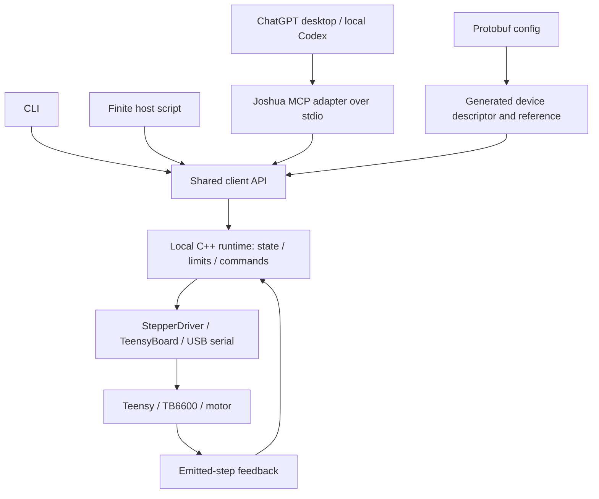

# Joshua Hardware API: MHS-inspired proof of concept

Status: proposed implementation plan; no runtime changes included.

Research date: September 13, 2026. Joshua baseline reviewed: `9bd755a`.

Demo hardware: existing Teensy 4.1 + TB6600 + stepper setup.

First client: ChatGPT desktop app's local Codex environment, connected to Joshua MCP over stdio.

## Objective

Prove that **an LLM can discover a user-configured device, understand its capabilities and limitations, operate it through a common interface, and read the resulting state**.

Focus the prototype on concepts explicitly described in Anthropic's public MHS announcement. Use Joshua's existing stepper hardware and drivers. Keep the interface experimental under `joshua.hardware.v0`; the public description does not establish a wire contract or MHS compatibility.

The first demo is a bounded motor move and return. It should show the value of a self-describing machine and shared control interface. Remote gateway infrastructure is follow-up work.

## Scope grounded in the public description

Anthropic explicitly describes standardized drivers, discovery, read/write primitives, natural-language device tags that generate reference material, enforced limits, MCP/CLI/API access, model independence, and deterministic execution beneath high-level agent decisions. The following are Joshua implementations of those concepts, not claimed MHS schema or method names. [Anthropic announcement](https://www.anthropic.com/news/model-hardware-standard-research-preview)

| Publicly described concept | Proof-of-concept deliverable |
|---|---|
| Standardized driver interface | One Joshua interface wrapping the existing stepper driver, with discovery, read, and bounded write operations |
| Device discovery | Enumerate devices from the selected config and identify which capabilities the running backend supports |
| Natural-language device information and generated reference material | Generate a machine-readable descriptor and human-readable device reference from config plus backend capability metadata |
| Read/write primitives | Read emitted-step state; write a bounded absolute position target in explicitly declared units |
| Enforced safety limits | Reject invalid or out-of-range requests locally before sending motor commands |
| MCP, CLI, and API access | Thin MCP and CLI adapters plus a callable client API using the same runtime |
| High-level agent decisions and deterministic execution | Agent chooses targets; a finite script sequences commands and Teensy generates pulses independently of LLM timing |
| Model independence | Keep model-specific code out of the runtime; repeat the demo using a second LLM host |

Multi-device orchestration is also publicly described, but this first demo has one motor. Keep it as the next capability experiment rather than claiming the single-device demo proves it. MHS remains an application-based preview ahead of open sourcing. [MHS project site](https://modelhardwarestandard.com/)

## Demo: discover, move, read, return

Example user instruction:

> Describe the available motor and its limits. Move it 10 degrees from the session reference, then return and report what happened.

The angle is illustrative; the operator-selected preset supplies the actual travel bounds and fixed pulse rate.

1. The operator selects the Teensy demo config, establishes a session reference, and enables the local runtime for the supervised task.
2. The agent discovers the motor and reads its generated description: position capability, units, limits, fixed speed, and open-loop feedback.
3. It reads the current controller count and calculates an absolute target within the configured limits.
4. It requests the move, then reads state until the controller count reaches the quantized target or the local timeout expires.
5. It requests a return to the recorded reference and reports controller results. The operator observes physical shaft motion, optionally recording a reference mark and video.
6. It requests a target outside the declared range; Joshua rejects it without sending a motion command.
7. Run a short deterministic move-and-return script through the client API. Repeat equivalent operations through the CLI and MCP to demonstrate shared semantics.

The prototype does not need a camera, encoder, new firmware, or MuJoCo. A reviewed script can run on the host through the API; the runtime does not accept arbitrary code from the agent as a tool argument.

## Reuse the existing Teensy path

| Existing Joshua component | Work needed |
|---|---|
| [Teensy stepper preset](../config/config_preset/example/teensy_stepper_demo.pbtxt) | Derive an opt-in agent preset, retaining configured wiring and conversion values |
| [Config schema](../config/proto/config.proto) and [actuator schema](../robot/action/proto/action.proto) | Add missing descriptive metadata and API exposure settings; reuse existing limits |
| [StepperDriver](../robot/action/motors/drivers/stepper_driver.cc) | Add disarmed initialization for this path and expose controller feedback with motor-unit conversion |
| [TeensyBoard](../robot/board/teensy/teensy_board.h) and shared board implementation | Reuse serial protocol, channel commands, and `BoardChannel::ReadFeedback()` through one owner |
| [Actuator subscriber](../ros2/actuator_subscriber.cc) and [launcher](../launcher/joshua_main.cc) | Ensure the API executor replaces the subscriber for this device; do not open the bus twice |
| [Teensy firmware](../firmware/teensy/41/README.md) | Reuse installed position-target and emitted-step feedback behavior |

The reference preset supplies the port, pins, steps per degree, gear ratio, pulse rate, and operational range. Those values remain in configuration. Its existing 0–360 degree range and 4000 Hz pulse-rate setting are reference values, not automatically the chosen demo envelope.

The firmware reports emitted pulses, not measured shaft position. Describe state as `feedback_kind: emitted_steps`, with estimated degrees and `physical_position_verified: false`. Its velocity field is not measured velocity, and zero fault flags do not establish that the motor has not stalled. Do not expose homing, acceleration control, or adjustable per-move speed as supported capabilities. [Firmware behavior](../firmware/teensy/41/src/main.cpp), [pulse generation](../firmware/common/backend_stepdir.cpp)

## Minimal architecture and interface



Use Python for the MCP/CLI/client adapters and C++ for hardware-facing execution. Keep Python out of `robot/`. Select the smallest local IPC option that fits Joshua's Bazel dependencies; keep it private to the local adapters. Use an existing MCP SDK rather than implementing the protocol. [MCP architecture](https://modelcontextprotocol.io/docs/learn/architecture)

For the first demo, register Joshua in the ChatGPT desktop app under **Settings → MCP servers → Add server**, using a stdio startup command for the Docker-managed adapter on the Joshua host. Keep startup limited to the adapter and config-only discovery; starting the hardware runtime and enabling motion remain explicit operator actions. Verify tool discovery in the desktop app's local Codex environment before bench use. The desktop app supports local stdio and Streamable HTTP MCP servers. [OpenAI MCP configuration guide](https://learn.chatgpt.com/docs/extend/mcp)

ChatGPT web integration is a later transport option through developer mode and a reachable HTTPS endpoint or Secure MCP Tunnel, subject to account/workspace availability. It can reuse the tool definitions and hardware runtime. No hosted gateway or plugin publication is needed for the selected desktop demo. [OpenAI connection guide](https://developers.openai.com/plugins/deploy/connect-chatgpt)

Proposed methods:

| Method | Meaning |
|---|---|
| `list_devices()` | List configured devices and runtime availability; offline discovery opens no hardware |
| `describe_device(device_id)` | Return supported operations, schemas, units, descriptions, limits, and feedback semantics |
| `read_state(device_id)` | Return emitted steps, estimated degrees, host receipt time, validity, and current command status |
| `write_position(device_id, position_deg)` | Validate and submit one finite absolute target; return accepted target and quantized steps, not a claim of physical completion |
| `stop_device(device_id)` | Local interruption helper for the bench setup; report whether controller disable was acknowledged |

Read/write and discovery implement the public concepts. These method names, command status, and the stop helper are Joshua-specific details needed to demonstrate them on this hardware.

Keep one active move at a time and no motion queue. Reject another write while moving; reads and stop remain available. A shared `move_and_wait` client helper can submit a target and poll state using a finite timeout, allowing CLI, MCP, and scripts to reuse the same behavior. The runtime also owns a maximum move duration so it does not depend solely on client polling.

Report `controller_target_reached` only from fresh pulse-count feedback at the target. Report connection loss or ambiguous execution as unknown. Do not automatically retry writes or resume a script after restart. Return-to-reference is a separate requested move, never an automatic failure cleanup action.

## Config-generated device reference

Add a small, disabled-by-default API section, such as `config/proto/hardware_api.proto`, referencing existing actuator identifiers. Add only missing fields: exposure, human descriptions, session-reference semantics, maximum per-move travel, move timeout, and feedback freshness threshold. Keep existing wiring, gear ratios, and position limits in their current fields.

Generate the descriptor, device reference document, and tool schemas from validated config plus implemented backend capabilities. For the demo motor, describe:

- What it is: one stepper axis driven by Teensy through a TB6600.
- What can be changed: absolute target position within the configured range.
- What can be read: controller pulse count and estimated angle.
- What is enforced: position and per-move bounds, valid units, finite values, one active move, and timeout behavior.
- What it cannot establish: true shaft position, missed steps, homing, or stall detection.
- How timing works: the preset fixes pulse rate; firmware generates pulses.

Human descriptions explain the device; structured fields enforce limits. Do not infer authority or change limits from descriptive text. Validate references, numeric presence, finite values, ordered ranges, and unit conversion before enabling writes. Freeze configuration for the running demo; changed metadata requires a disarmed restart.

## Essential bench behavior

These are local implementation requirements for the selected hardware, not claims about unpublished MHS requirements. Keep them small and specific:

- **Explicit start and one owner:** config discovery never opens devices. The stepper driver currently enables during initialization; add a disarmed API path. Run only the API executor for this motor, excluding competing legacy command publishers and serial owners.
- **Bounded commands:** enforce limits in the runtime, including after conversion and rounding. Use finite position moves at an operator-selected fixed pulse rate. Reject stale or invalid controller state.
- **Stop without idle motion:** stepper teardown writes an idle target before disabling, so do not use it for stop. For the reviewed bench load, disable the channel. Before re-enable, replace the retained target with the current controller position while disabled, then require explicit operator enable.
- **Reference validity:** pulse counts do not provide a physical zero. Invalidate the session reference after disconnect, possible reset, manual movement, or disabling that may allow movement; re-establish it with the operator.
- **Link-loss limits:** the reviewed firmware has no communication-loss watchdog. A submitted target may continue after the host disappears. Keep the demo supervised with an accessible independent stop; report stopping as unconfirmed if serial communication fails. Firmware watchdog work is deferred.

Use ordinary command/state/error logs and a short demo recording to inspect results. A durable audit journal, authorization service, or session-leasing system is not required for this local proof of concept.

## Deferred work and edge-mhs's role

Defer multi-user authorization, per-principal quotas, cumulative usage accounting, durable audit infrastructure, distributed registries/caches, preview tokens, session leases, persistent idempotency, asynchronous job services, cloud deployment, and remote access. Also defer additional devices, simulation backends, and firmware changes.

Fastly's project remains a reference for small separable validators and tests that assert denied calls never reach a backend. Its gateway-specific architecture and placeholder MHS endpoints are not prototype dependencies. Those extensions may be useful after the core demo establishes value. [edge-mhs README](https://github.com/fastly/edge-mhs#readme), [policy implementation](https://github.com/fastly/edge-mhs/blob/main/crates/mhs-safety-policy/src/lib.rs)

## Delivery and acceptance

Target roughly two to three weeks for one local hardware demo, assuming contributors familiar with Joshua's C++ and Python stack. Estimate again after the initial feedback and lifecycle work; elapsed time is not an acceptance criterion.

| Milestone | Deliverable | Acceptance |
|---|---|---|
| 1. Discovery and description | API schema, opt-in Teensy preset, generated descriptor/reference | Correct capabilities and limitations; discovery causes no device I/O; renamed device and changed limits require no adapter edits |
| 2. Read/write runtime | Existing driver integration, feedback conversion, local validation and stop | CLI reads state and performs one bounded move/return; invalid input causes zero motion dispatches |
| 3. MCP and deterministic API use | MCP adapter registered in ChatGPT desktop's local Codex environment, shared client helper, finite example script | ChatGPT discovers and operates the motor through Joshua MCP; script and CLI use the same semantics and enforcement |
| 4. Repeatability | Short video and results table | Five supervised move/return trials through ChatGPT desktop/local Codex; a second LLM host repeats the same task without device-specific code changes |

Record controller completion and observed physical movement separately. Include one out-of-range rejection in the demo. Document any failed trials and manual intervention. Success establishes a usable interface on one device; it does not prove physical positioning accuracy, multi-device orchestration, or official MHS interoperability.

Before bench execution, extend existing C++ test doubles to cover limit rejection, non-finite values, degree-to-step rounding, stale feedback, concurrent-write rejection, disarmed startup, stop/re-enable behavior, and ambiguous transport failure. These tests need neither hardware nor a new simulator. Verify implementation on both supported Docker stacks:

```bash
docker compose run --rm test-u22
docker compose run --rm test-u24
```

Suggested changes: a small `gateway/` package for descriptors and adapters; the config schema/preset; a C++ executor under `ros2/`; narrow stepper feedback/lifecycle changes under `robot/`; and demo documentation. Add a `.github/CODEOWNERS` entry for any new top-level directory. Follow the [board RFC](BOARD_LAYER_RFC.md), keep PRs focused, and target `develop`.

Use a dedicated Docker demo service exposing the selected Teensy serial device only to the executor. Apply [AGENTS.md](../AGENTS.md) when running hardware. This plan reuses the existing setup and installed firmware; it does not launch hardware or request flashing.

After the demo, choose the next experiment from the evidence: another machine, multi-device sequencing, or official MHS integration once a specification is available.
