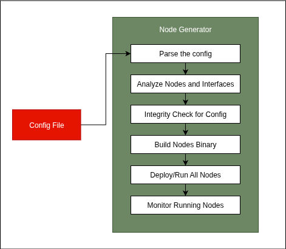

# Node Generator

The `Node Generator` is a core component of Project Joshua, responsible for dynamically instantiating and managing ROS2 nodes based on a single configuration file. It acts as an orchestrator, parsing the user-defined robot configuration, building the necessary binaries, launching the nodes, and monitoring their lifecycle.



## Workflow

The Node Generator follows a clear, sequential process to bring the robotic system to life, as illustrated in the diagram above:

1.  **Parse the Config**: The process begins by reading a `.pbtxt` configuration file specified via the `--config` flag. This file contains all the necessary information about the robot's hardware, sensors, actuators, and AI policies.

2.  **Analyze Nodes and Interfaces**: The generator analyzes the configuration to identify all the required perception (e.g., cameras, encoders) and action (e.g., motors) components. It groups these components by their assigned `node_id`.

3.  **Integrity Check for Config**: It performs a series of checks to ensure the configuration is valid and all required information is present. This step prevents runtime errors due to misconfiguration.

4.  **Build Nodes Binary**: Based on the analysis, the Node Generator determines which ROS2 nodes need to be built. It then invokes `bazel build` to compile the required targets, such as `camera_publisher`, `encoder_publisher`, and `actuator_subscriber`.

5.  **Deploy/Run All Nodes**: Once the binaries are successfully built, the generator launches each node as a separate process using `fork()` and `execl()`. It sets up the necessary environment variables (e.g., `AMENT_PREFIX_PATH`) for each node to function correctly within the ROS2 ecosystem.

6.  **Monitor Running Nodes**: After launching, the Node Generator continuously monitors the status of all child processes. If a node terminates unexpectedly, it logs the event. It also handles teardown, ensuring that all node processes are terminated cleanly when the main program exits.

## Usage

The Node Generator is executed from the command line, pointing to a specific configuration file.

### Running the Node Generator

To run the Node Generator, execute the following command from the workspace root:

```bash
bazel run //node_generator:main -- --config="config/config_preset/your_config_file.pbtxt"
```

Replace `your_config_file.pbtxt` with the path to your desired robot configuration. For example, to run the `so100_teleoperate` configuration, you would use:

```bash
bazel run //node_generator:main -- --config="config/config_preset/so100_teleoperate.pbtxt"
```

The application will then:
-   Initialize and validate the configuration.
-   Build the required ROS2 nodes.
-   Launch and monitor the nodes.

Logs will be printed to the console, indicating the status of each step.
