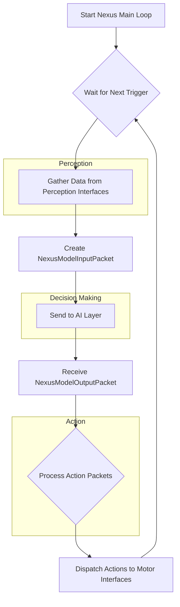

# Nexus: The Robotic System's Central Hub

The `Nexus` class is the core of the UbiRobotics architecture, acting as the central nervous system for the robot. It is responsible for orchestrating the flow of information between the robot's perception systems (sensors like cameras) and its action systems (actuators like motors).

## Core Responsibilities

1.  **Interface Management**: `Nexus` maintains a registry of all available perception and action interfaces. These interfaces are dynamically registered with Nexus at runtime, allowing for a flexible and modular system where components can be easily added or removed.

2.  **Data Synchronization**: It runs a main loop, synchronized by the `NexusScheduler`, that ensures data is gathered from all perception interfaces at a consistent frequency.

3.  **Orchestration of Data Flow**: The `Nexus` class manages a clear, sequential data pipeline:
    - **Perception**: It triggers all registered perception interfaces to capture data (e.g., an image from a camera). This data is then packaged into `NexusPerceptionPacket` messages.
    - **Aggregation**: These perception packets are collected into a `NexusModelInputPacket`.
    - **AI Layer Interface**: This input packet is sent to the AI layer, which is responsible for making decisions. (Currently, this is a mock function that generates random actions.)
    - **Action Dispatch**: The AI layer returns a `NexusModelOutputPacket` containing a series of `NexusActionPacket` messages. `Nexus` dispatches each of these action packets to the appropriate action interface based on a unique ID.

## How It Works

The `Nexus` class is built around a main `run()` method that executes in a dedicated thread. This loop is the heartbeat of the robot.

### Key Components:

- **`interface_variant.h`**: Defines `ActionInterface` and `PerceptionInterface` using `std::variant`. This allows `Nexus` to hold different types of interfaces (e.g., various motors, cameras) in a type-safe way.
- **`nexus_packet.proto`**: Contains the Protobuf definitions for all the message types that flow through the Nexus, ensuring a standardized data format.
- **`nexus_scheduler.h`**: A simple scheduler that controls the frequency of the main loop, ensuring consistent timing.

### Future Integration

The current implementation includes a `GenerateMockAIOutput` function that simulates the output of the AI layer. To integrate a real AI model, this function can be swapped out with a call to the actual model, which will receive the `NexusModelInputPacket` and is expected to return a `NexusModelOutputPacket`.
